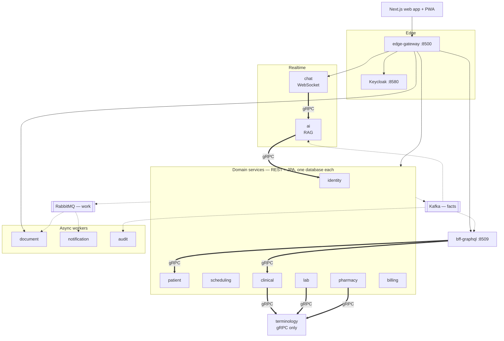

# HealthPack

A patient's data usually lives in six systems that don't talk to each other. Appointments in one,
lab results in another, prescriptions in a third. The information exists — it just never arrives
where it's needed, when it's needed.

HealthPack is an integrated care platform built as **15 Spring Boot microservices** that keep those
pieces in sync by broadcasting to each other, so nobody has to remember to notify anybody.

> **Status:** M1 — `patient-service`.
> **Roadmap:** v0.1 Nov 2026 · v0.2 Dec 2026 · v0.3 Mar 2027 · v1.0 mid-2027
> Built one service at a time. The table below marks what exists and what doesn't.

---

## Architecture



`───▶` REST · `═══▶` gRPC · `╌╌▶` async messaging

### Why three protocols

| Protocol | Where | Reason |
|---|---|---|
| **REST** | every external API | Cacheable, debuggable with `curl`, browser-native. The right default |
| **GraphQL** | `bff-graphql` only | The patient dashboard needs data from five services in one round trip, in a client-driven shape |
| **gRPC** | service-to-service only | Sub-kilobyte payloads called on nearly every clinical write, with a schema that never changes shape |

The BFF's DataLoader collects every ID requested in one event-loop tick and issues a single
`batchGet` per service, so a 50-patient query makes 3 internal calls instead of 150.

### Why two brokers

**Kafka carries facts. RabbitMQ carries work.**

Kafka holds immutable records of things that happened — replayable from offset zero, consumed
independently by audit, billing and RAG ingestion. RabbitMQ carries commands with exactly one
correct handler — "render this PDF", "send this notification" — where per-message acks, backoff and
a dead-letter queue matter.

---

## Services

| Service | HTTP | gRPC | Responsibility | Status |
|---|---|---|---|---|
| `edge-gateway` | 8500 | — | Routing, JWT validation, rate limiting | ⬜ M2 |
| `identity-service` | 8501 | 9501 | Subject↔patient links, consent | ⬜ M9 |
| `patient-service` | 8502 | 9502 | Patient identity and demographics | 🚧 M1 |
| `scheduling-service` | 8503 | — | Availability, slots, appointments | ⬜ M3 |
| `clinical-service` | 8504 | 9504 | Encounters, observations, conditions | ⬜ M6 |
| `lab-service` | 8505 | — | Lab orders, HL7 v2 ingestion, critical values | ⬜ M7 |
| `pharmacy-service` | 8506 | — | Prescriptions, interaction checks | ⬜ M7 |
| `billing-service` | 8507 | — | Invoices, Stripe payments | ⬜ M10 |
| `terminology-service` | 8508 | 9508 | ICD-10, SNOMED, RxNorm, LOINC lookups | ⬜ M7 |
| `bff-graphql` | 8509 | — | GraphQL for the frontend | ⬜ M8 |
| `document-service` | 8510 | — | PDF rendering, signing, storage | ⬜ M5 |
| `notification-service` | 8511 | — | Web push, email, SMS | ⬜ M4 |
| `audit-service` | 8512 | — | Hash-chained, tamper-evident audit log | ⬜ M6 |
| `chat-service` | 8513 | — | WebSocket chat and AI streaming | ⬜ M9 |
| `ai-service` | 8514 | 9514 | RAG over patient documents | ⬜ M9 |

✅ done · 🚧 in progress · ⬜ planned

---

## Stack

**Core** — Java 25 · Spring Boot 4.1 · Maven multi-module
**Transport** — REST · GraphQL · gRPC + Protobuf · WebSocket/STOMP · SSE
**Messaging** — Kafka (KRaft) · Kafka Streams · RabbitMQ
**Data** — PostgreSQL 17 · pgvector · Redis · S3-compatible storage · Flyway
**AI** — Spring AI · Claude · Voyage embeddings
**Healthcare** — HAPI FHIR R4 · HAPI HL7 v2 · ICD-10-CM · RxNorm · LOINC
**Security** — Keycloak (OIDC) · OAuth2 Resource Server · Vault
**Observability** — Micrometer · OpenTelemetry · Grafana · Tempo · Loki · Prometheus
**Testing** — JUnit 5 · Testcontainers · REST Assured · JMeter · Playwright

---

## Running it locally

**Requirements:** JDK 25, Docker, and about 8 GB of free RAM once several services are up.

```bash
# 1. infrastructure — postgres, redis, kafka, rabbitmq, keycloak, mailpit, minio, grafana
docker compose -f infra/docker-compose.yml up -d

# 2. build everything
./mvnw verify

# 3. run one service
./mvnw -pl services/patient-service spring-boot:run
```

| What | Where |
|---|---|
| Swagger UI | `http://localhost:8502/swagger-ui.html` |
| Grafana | `http://localhost:3000` |
| Mailpit inbox | `http://localhost:8025` |
| RabbitMQ management | `http://localhost:15672` |
| MinIO console | `http://localhost:9001` |
| Keycloak admin | `http://localhost:8580` |

Every setting is `${ENV_VAR:default}`, so nothing needs editing to run locally and nothing needs
editing to run in a container either.

---

## Layout

```
healthpack/
├── platform/
│   ├── healthpack-common/   error model, correlation IDs, outbox, event envelope
│   └── healthpack-proto/    .proto contracts and generated gRPC stubs
├── services/                the 15 deployable Spring Boot applications
├── infra/                   docker-compose and infrastructure config
└── docs/                    architecture notes, ADRs, dev log
```

`platform/` holds libraries — no `main`, no port, nothing to start. `services/` may depend on
`platform/`; `platform/` never depends on `services/`.

---

## Conventions

- **Flyway owns every schema.** Hibernate runs with `ddl-auto=validate` and refuses to start if
  the entity and the migration disagree.
- **Correctness lives in the lowest layer that can enforce it.** Double-booking is blocked by a
  PostgreSQL exclusion constraint, not an application check that loses a race.
- **No shared domain classes.** `healthpack-common` carries plumbing only; two services sharing an
  entity are coupled through it.
- **Integration tests use Testcontainers**, never H2 — the bugs worth catching only reproduce
  against the real database.
- **Every real decision gets an ADR** in `docs/adr/`.

---

## Roadmap

| | Milestone | Target |
|---|---|---|
| v0.1 | patient, scheduling, gateway, Keycloak, gRPC, tracing — deployed | Nov 2026 |
| v0.2 | outbox, RabbitMQ, notifications, PDFs, web push, thin UI | Dec 2026 |
| v0.3 | Kafka, clinical records, audit chain, terminology, lab, pharmacy, GraphQL | Mar 2027 |
| v1.0 | consent, RAG assistant, chat, billing, full frontend, hardening | mid-2027 |
